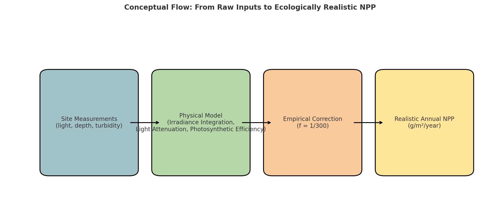
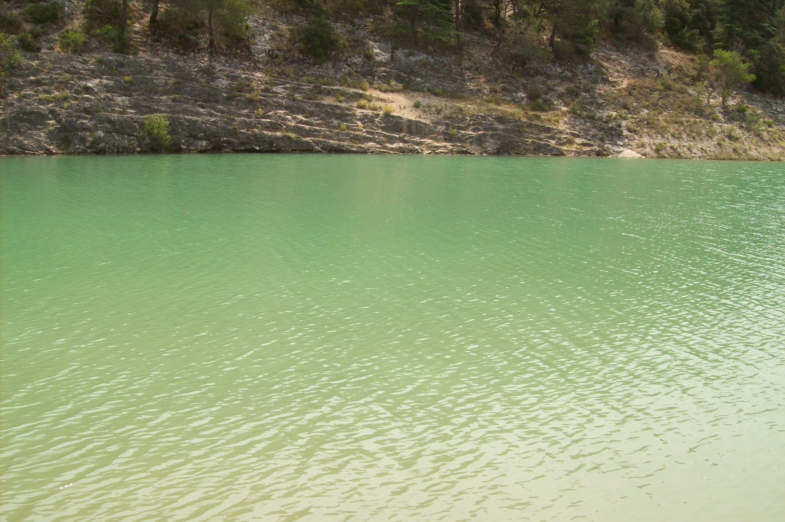

# 🌿 Lake NPP Modeling – Empirical Bioenergetics with Field & AI Support

This repository presents a practical and biologically realistic estimation of **Net Primary Production (NPP)** in a natural lake ecosystem using:

- Real-world field measurements (light, turbidity, depth, temperature, pH, KH),
- A physically-based irradiance integration model (Python),
- An empirical ecosystem correction factor,
- And interpretative support by **GPT-4o** (OpenAI), enhancing ecological reasoning and dynamic parameter tuning.

---

## 🧪 Methodology Overview

### 1. **Field Protocol & Equipment**

Measurements were taken from two sites: **Lake du Paty** (altitude ~400 m, surface 3.5 ha, max depth ~20 m) and **the Ouvèze River**.

Parameters measured **on-site**:
- pH, KH, NO₃⁻/NO₂⁻, GH via **JBL 7-in-1 test strips**
- Water temperature (digital thermometer)
- Visual turbidity (sunlight and suspended particles)
- Sampling was done using **a custom-built pole**, **boots**, and **a cold-preserved thermos** for turbidimetry.

Turbidity was then analyzed **at home** using a custom low-cost photometric system (see companion repository [📎 TurbiditySensor_OpenScience](https://github.com/Jerome-openclassroom/TurbiditySensor_OpenScience)).

1.1 Ecological Field Data (Lake du Paty – June 2025)
The following parameters were measured directly on-site under clear sky conditions at midday:

- pH: 7.5–8.0

- KH (carbonate hardness): 6 °dKH

- GH (general hardness): 14–21 °dGH

- Nitrate/Nitrite: 0 mg/L (undetectable)

- Water temperature: 22°C

- Air temperature: min 16°C / max 26°C

- Estimated CO₂ concentration (from pH and KH chart): 2–5 mg/L

- Turbidity (JTU): < 5 (confirmed post-transport via calibrated optical sensor)

- Observed biodiversity: numerous alevins, two species of odonates (anisoptera), several lepidoptera

These values confirm a clear, oxygenated, weakly alkaline freshwater body, with low nutrient content and high photic zone depth — matching mesotrophic to oligotrophic profiles.

1.2 Ecological Field Data (Ouvèze River – June 2025, Bédarrides site)
Measurements were taken a few meters downstream of a small cascade, under optimal solar exposure:

- pH: 7.5–8.0

- KH (carbonate hardness): 15 °dKH

- GH (general hardness): estimated < 21 °dGH

- Nitrate/Nitrite: 0 mg/L (undetectable)

- Water temperature: 20°C

- Estimated current speed: 0.5–1.0 m/s (visual estimation)

- Estimated CO₂ concentration (from pH and KH): 5–11 mg/L

- Turbidity (JTU): < 5 (confirmed via calibrated turbidimeter after gentle remixing)

- Biodiversity indicators: clear water, presence of fish, high oxygenation due to upstream cascade

These data indicate a carbonate-buffered, oxygen-rich stream with extremely low nutrient levels and high water clarity, ideal for light penetration and consistent with low turbidity high-flow environments.

---

### 2. **Python Model Description**

The NPP model integrates:

- **Hourly irradiance** over 24h (bell-shaped solar curve)
- **Light attenuation** using measured turbidity-derived `k` values
- **Photosynthetic efficiency** and energy-to-mass conversion via enthalpy of cellulose
- **Autotrophic respiration losses**

A **correction factor `f = 1/300`** was introduced to translate ideal daily production into a realistic annual average, accounting for:

- Mortality and senescence
- Zooplankton grazing
- Respiration and trophic recycling
- Seasonal variation and nutrient constraints

---

## 📈 Diagram – Model Flow



---

## 🖼️ Field Reference – Ecological Clarity

The lake's turquoise to green coloration suggests high clarity and photic penetration, consistent with the very low turbidity measurements (4–5 JTU).



---

## 🤖 Role of AI (GPT-4o)

The **model construction, parameter tuning**, and **ecological interpretation** were all co-developed in real time using **GPT-4o**.

This includes:
- Light integration modeling,
- Calculation of euphotic depth (`Zeu`) from turbidity,
- Bioenergetic correction and annual scaling,
- Ecological reasoning and trophic interpretation (predation, respiration),
- Visualization and repository documentation.

---

## 📂 Repository Structure

```
📁 pictures/
├── diagram.jpg         ← NPP conceptual diagram
├── Lake_1.jpg
├── Lake_2.jpg          ← illustrative coloration of the lake
├── River_1.jpg
├── River_2.jpg
├── Sampling.jpg        ← sampling on site
├── Tools.jpg           ← field material used
```

---

## 🔬 Outputs

- **Daily NPP (ideal theoretical)**: ~93.05 g/m²/day
- **Corrected annual NPP** (f = 1/300): ~113.2 g/m²/year
- Consistent with mesotrophic lake ecosystems

---
🔗 **See also my related work on GitHub**:
## 🔗 Part of the Lyra Ecosystem

- [Lyra_Leaf_SPAD_Calibration](https://github.com/Jerome-openclassroom/Lyra_Leaf_SPAD_Calibration) – SPAD sensor calibration for estimating chlorophyll density in leaves.
- [Lyra_LowCost_Soil_Leaf](https://github.com/Jerome-openclassroom/Lyra_LowCost_Soil_Leaf) – Integrated low-cost soil and leaf model for terrestrial primary productivity.
- [Leaf_Chlorose_CNN_Training](https://github.com/Jerome-openclassroom/Leaf_Chlorose_CNN_Training) – CNN-based classification of chlorotic vs. healthy leaves from scanned images.
- [Lyra_DO_Green_Mesurim](https://github.com/Jerome-openclassroom/Lyra_DO_Green_Mesurim) - A low-tech protocol combining MesurimPro and ImageJ to estimate chlorophyll levels from scanned leaves, with validation against SPAD readings and AI-assisted correlation analysis.
- [TurbiditySensor_OpenScience](https://github.com/Jerome-openclassroom/TurbiditySensor_OpenScience) - A low-cost optical turbidity sensor calibrated in JTU, illustrating an open science approach for accessible, field-based water quality monitoring.
- [LimonTree_NPP_Model](https://github.com/Jerome-openclassroom/LimonTree_NPP_Model) — Low-cost water and NPP model for a potted lemon tree.


## 📜 License

This project is open science. You are free to reuse, adapt, and expand it under the terms of the MIT License.
