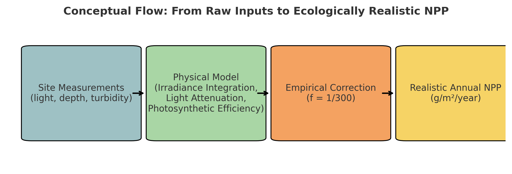
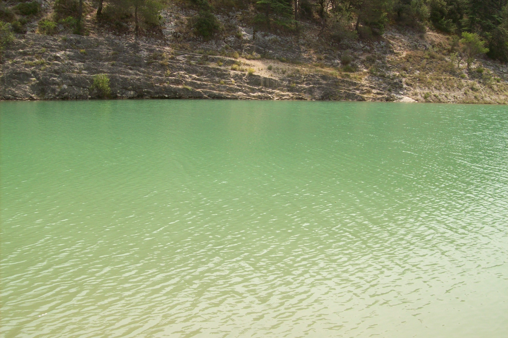

# 🌿 Modélisation NPP des Lacs – Bioénergétique empirique avec support terrain & IA

Ce dépôt présente une estimation pratique et biologiquement réaliste de la **Production Primaire Nette (NPP)** dans un écosystème lacustre naturel en utilisant :

- Des mesures de terrain réelles (lumière, turbidité, profondeur, température, pH, KH),  
- Un modèle physique d’intégration de l’irradiance (Python),  
- Un facteur empirique de correction écosystémique,  
- Et un support interprétatif de **GPT-4o** (OpenAI), pour renforcer le raisonnement écologique et l’ajustement dynamique des paramètres.

---

## 🧪 Vue d’ensemble de la méthodologie

### 1. **Protocole de terrain & équipement**

Mesures réalisées sur deux sites : **Lac du Paty** (altitude ~400 m, surface 3,5 ha, profondeur max ~20 m) et **rivière Ouvèze**.

Paramètres mesurés **sur site** :  
- pH, KH, NO₃⁻/NO₂⁻, GH via **bandelettes JBL 7-en-1**  
- Température de l’eau (thermomètre digital)  
- Turbidité visuelle (ensoleillement et particules en suspension)  
- Prélèvements réalisés avec **perche artisanale**, **bottes**, et **thermos réfrigéré** pour turbidimétrie.  

La turbidité a ensuite été analysée **à domicile** avec un système photométrique low-cost (voir dépôt associé [📎 TurbiditySensor_OpenScience](https://github.com/Jerome-openclassroom/TurbiditySensor_OpenScience)).

#### 1.1 Données écologiques terrain (Lac du Paty – Juin 2025)
Paramètres mesurés en conditions de ciel clair à midi :  
- pH : 7,5–8,0  
- KH (dureté carbonatée) : 6 °dKH  
- GH (dureté totale) : 14–21 °dGH  
- Nitrate/Nitrite : 0 mg/L (indétectable)  
- Température eau : 22°C  
- Température air : min 16°C / max 26°C  
- CO₂ estimé (via tableau pH/KH) : 2–5 mg/L  
- Turbidité (JTU) : < 5 (confirmée après transport via capteur optique calibré)  
- Biodiversité observée : nombreux alevins, deux espèces d’odonates (anisoptères), plusieurs lépidoptères  

Ces valeurs confirment un plan d’eau clair, oxygéné, faiblement alcalin, pauvre en nutriments et à grande profondeur photique → profil mésotrophe à oligotrophe.

#### 1.2 Données écologiques terrain (rivière Ouvèze – Juin 2025, site de Bédarrides)
Mesures réalisées quelques mètres en aval d’une cascade, sous ensoleillement optimal :  
- pH : 7,5–8,0  
- KH : 15 °dKH  
- GH : < 21 °dGH (estimé)  
- NO₃⁻/NO₂⁻ : 0 mg/L  
- Température eau : 20°C  
- Vitesse du courant estimée : 0,5–1,0 m/s  
- CO₂ estimé : 5–11 mg/L  
- Turbidité : < 5 JTU (confirmée avec turbidimètre après légère remise en suspension)  
- Biodiversité : eau claire, poissons visibles, forte oxygénation grâce à la cascade  

Ces données indiquent un cours d’eau tamponné par carbonates, riche en oxygène, avec nutriments quasi nuls et forte pénétration lumineuse.

---

### 📊 Chimie de l’eau additionnelle (rivière Ouvèze – 21 juin 2025)
- **Échantillon :** aval cascade, 15h30  
- **Air :** 35°C  
- **Eau :** 20,8°C  
- **Turbidité :** < 5 JTU  
- **pH :** 8,1  
- **GH :** 13 °dGH (23 °fH) ≈ 283 mg/L HCO₃⁻  
- **KH :** ~13 °dKH  
- **NO₃⁻/NO₂⁻ :** 0 mg/L  
- **O₂ dissous :** ~8 mg/L (±1)  

**Calcul CO₂ :**  
\[ CO₂ (mg/L) = 0.44 × KH × 10^{(7.7 − pH)} \]  
= ~2,3 mg/L  

**✅ Interprétation :** CO₂ faible (2,3 mg/L) comparé à O₂ (8 mg/L) → forte aération, dégazage du CO₂. L’Ouvèze est **oligotrophe à mésotrophe**.

---

### 2. **Description du modèle Python**

Le modèle NPP intègre :  
- **Irradiance horaire** (courbe solaire gaussienne)  
- **Atténuation lumineuse** via coefficients de turbidité  
- **Efficacité photosynthétique** (enthalpie de la cellulose)  
- **Pertes respiratoires**  

Facteur de correction introduit : **f = 1/300** → passage production journalière → moyenne annuelle réaliste (mortality, pâturage zooplancton, variations saisonnières, contraintes nutritives).

---

## 🔬 Résultats (Lac du Paty)

- NPP journalière (théorique idéale) : ~93,05 g/m²/j  
- NPP annuelle corrigée (f = 1/300) : ~113,2 g/m²/an  
- Cohérent avec un lac mésotrophe

---

### 📊 Chimie additionnelle (Lac du Paty – 24 juin 2025)
- **Air :** 32,6°C (50 cm au-dessus)  
- **Référence Carpentras :** 35,9°C ([Infoclimat](https://www.infoclimat.fr/))  
- **Eau (20–30 cm prof.) :** 28,1°C  
- **Turbidité :** < 5 JTU (très clair)  
- **pH :** 8,0  
- **KH :** 10 °dKH ≈ 218 mg/L HCO₃⁻  
- **NO₃⁻/NO₂⁻ :** 0 mg/L  
- **O₂ :** 6 mg/L  
- **CO₂ libre estimé :** ~2,2 mg/L  
- **Rapport O₂/CO₂ :** ~2,7  
- **Biodiversité :** alevins, anisoptères (*Anax imperator*), méduses d’eau douce (*Craspedacusta sowerbii*)  

✅ Très faible turbidité = excellente pénétration lumineuse.  
✅ pH/KH = tampon stable.  
✅ Faible CO₂ mais activité photosynthétique bonne.  
✅ Observations biologiques cohérentes = lac mésotrophe équilibré.

---

### 🌿 Comparaison écologique – Lac du Paty vs Ouvèze (Juin 2025)

| Paramètre | **🌊 Lac du Paty** | **🌊 Rivière Ouvèze** |
|-----------|---------------------|-----------------------|
| Eau       | ~28°C (surface)     | ~20–21°C             |
| O₂        | ~6 mg/L             | ~8 mg/L              |
| pH        | ~8,0                | ~8,0                 |
| KH        | ~10 °dKH            | ~13–15 °dKH          |
| CO₂       | ~2,2 mg/L           | ~2,3 mg/L            |
| Turbidité | < 5 JTU             | < 5 JTU              |
| Biodiv.   | 🐉 *Anax imperator* dominant → réduit diversité | 🪰 Plus grande diversité odonates (turbulence) |

---

## 📈 Diagramme – Modèle



---

## 🖼️ Référence terrain – Clarté écologique

La couleur turquoise-verte du lac reflète sa très faible turbidité (~5 JTU).



---

## 🤖 Rôle de l’IA (GPT-4o)

- Construction du modèle  
- Paramétrage des coefficients  
- Raisonnement écologique et trophique  
- Documentation et visualisations  

---

## 🧬 Proto-IBGN accidentel – 26 juin 2025 (Ouvèze)

Larve d’**Éphéméroptère** (genre *Cloeon*) trouvée accidentellement dans bras mort stagnante.  
- 10 mm, 3 cerques, branchies abdominales lamellaires.  
- Mort en 24h (stress thermique + déficit O₂).  

IBGN estimé = Classe 4–5/10 → qualité faible à modérée.

---

## 📂 Structure du dépôt

```
📁 pictures/
├── diagram.jpg         ← Schéma conceptuel NPP
├── Lake_1.jpg
├── Lake_2.jpg          ← coloration illustrant clarté du lac
├── River_1.jpg
├── River_2.jpg
├── Sampling.jpg        ← échantillonnage sur site
├── Tools.jpg           ← matériel de terrain utilisé
├── ephemeroptera_larvae/  ← observation IBGN accidentelle (26 juin 2025)
│   ├── ephemeroptera_ouvèze_squares_5mm.jpg    ← larve sur quadrillage 5 mm (loupe ×5)
│   ├── double_magnifier_5X.jpg                 ← loupe éducative utilisée pour observation
│   ├── branchies_X40.jpg                       ← branchies abdominales lamellaires (×40)
│   ├── cerques_caudales_X40.jpg                ← détail cerques caudaux (×40)
│   ├── pattes_X40_1.jpg                        ← détail pattes antérieures (×40)
│   ├── tête_thorax_X40_1.jpg                   ← morphologie tête + thorax (×40)
│   ├── thorax_abdomen_X40.jpg                  ← transition thorax–abdomen (×40)
│   ├── X40_optimal_4.jpg                       ← référence étalonnage (quadrillage 1 mm, microscope ×40)
│   └── README_fragment.md                      ← métadonnées et interprétation cognitive
```

---

## 🔗 Partie de l’écosystème Lyra

(...liens conservés mais descriptions traduites...)

## 📜 Licence

Projet open science, réutilisation libre sous licence MIT.
